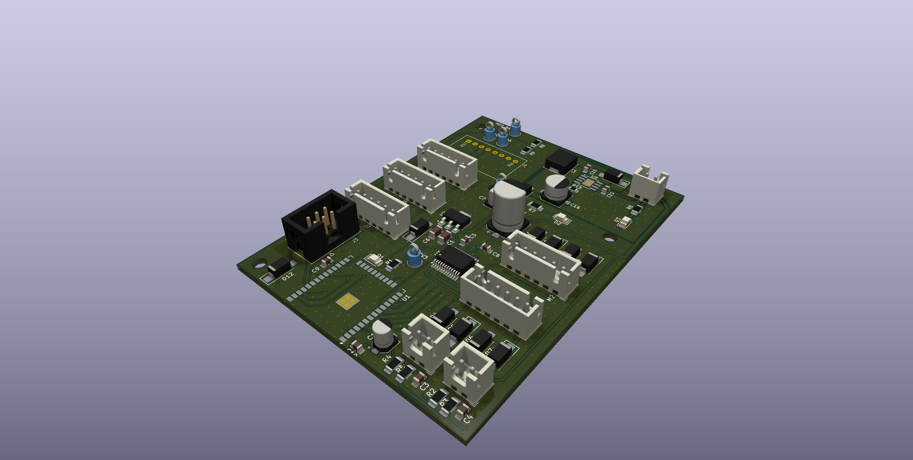
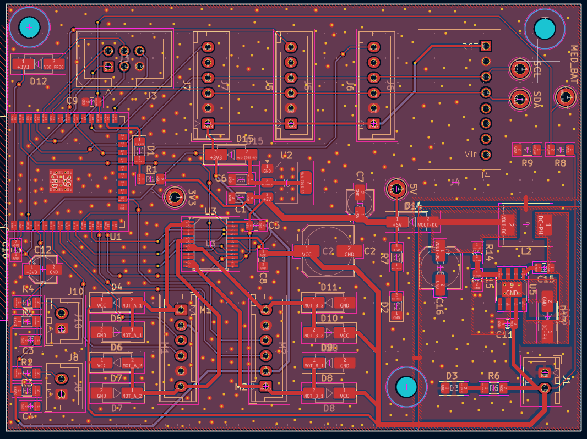
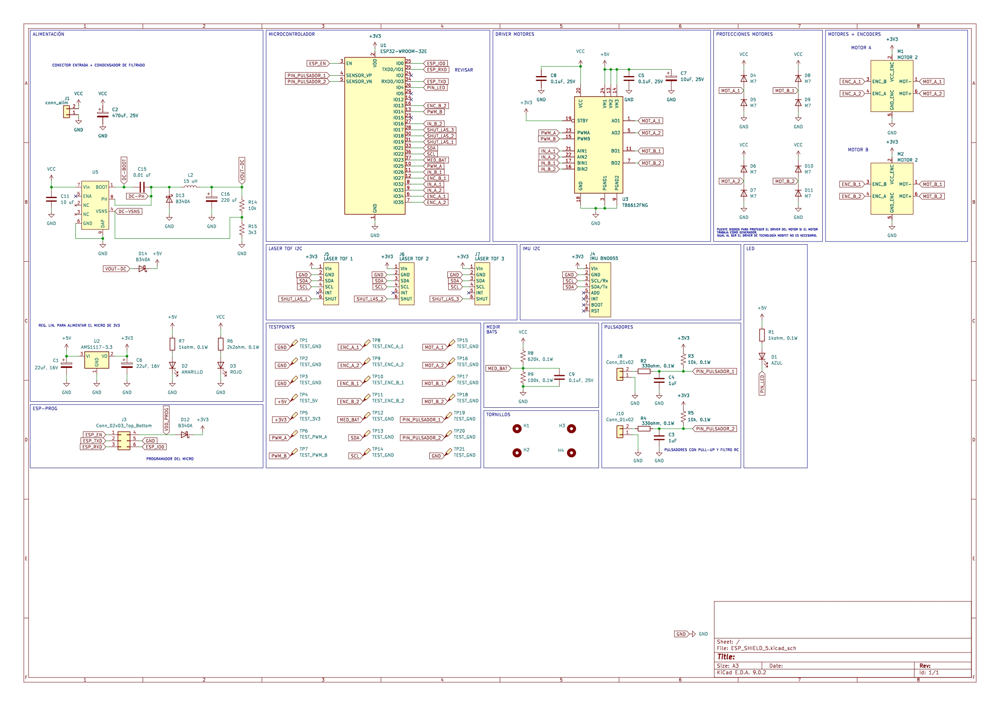

# TheBUG02 ⚡

## 🇬🇧 Project Description

<strong>TheBUG02</strong> is a custom <strong>all-in-one control PCB</strong> designed for a <strong>two-wheel differential drive robot</strong>.  
The project aims to provide a compact and integrated embedded platform that combines the essential hardware blocks required in a small mobile robot: power management, motor driving, microcontroller integration and battery monitoring.

Instead of relying on multiple external modules, this board concentrates the complete low-level electronics into a single PCB, making the robot easier to assemble, more reliable, and better suited for rapid prototyping and iterative development.

## What the project consists of

TheBUG02 is designed as a robotics electronics platform where the main control and power subsystems are already integrated on-board. The design includes:

* **ESP32-based control system** as the main processing unit
* **Integrated motor drivers** for controlling the DC motors of the robot
* **Integrated DC-DC converter** for efficient power conversion from the battery supply
* **Integrated linear regulator** for stable regulated voltage rails (3V3)
* **Battery voltage sensing** for supply monitoring and power supervision
* **ESP-PROG programming/debugging interface** for firmware upload and debugging
* **Compact full-SMD PCB design** for reduced size and improved manufacturability

## Project purpose

The purpose of TheBUG02 is to serve as a compact embedded controller for mobile robotics applications, especially small autonomous robots based on differential drive kinematics.

This board is intended to simplify the hardware side of robotics development by offering a self-contained solution that can be used for:

* Differential drive motor control
* Battery-powered robot platforms
* Embedded firmware development with ESP32
* Rapid robotics prototyping
* Autonomous navigation experiments
* Educational and research-oriented robotics projects

## Design approach

The project follows a clear design philosophy: reduce external wiring, improve electrical integration, and create a cleaner and more robust electronics architecture for mobile robots.

Instead of relying on several external modules, this board integrates all the low-level electronics into a single PCB, making the robot more compact, cleaner and easier to assemble.

Designing and integrating the electronics from scratch also provides a much deeper learning experience than simply connecting separate off-the-shelf modules.

## Images

### 3D View

### PCB Layout

### Schematic

---

## 🇪🇸 Español

<strong>TheBUG02</strong> es una <strong>PCB de control todo-en-uno</strong> diseñada para un <strong>robot diferencial de dos ruedas</strong>.  
El proyecto busca ofrecer una plataforma embebida compacta e integrada que reúna en una sola placa los bloques electrónicos principales necesarios en un robot móvil pequeño: gestión de alimentación, accionamiento de motores, integración del microcontrolador y monitorización de la batería.

En lugar de depender de varios módulos externos, esta placa integra toda la electrónica de bajo nivel en una única PCB, haciendo que el robot sea más compacto, limpio y fácil de montar.

Además, diseñar e integrar la electrónica desde cero supone un aprendizaje mucho más completo que limitarse a conectar módulos comerciales comprados por separado.

## En qué consiste el proyecto

TheBUG02 está planteado como una plataforma electrónica para robótica en la que los subsistemas principales de control y potencia ya vienen integrados en placa. El diseño incluye:

* **Sistema de control basado en ESP32** como unidad principal de procesamiento
* **Drivers de motores integrados** para el control de los motores DC del robot
* **Convertidor DC-DC integrado** para convertir de forma eficiente la alimentación desde batería
* **Regulador lineal integrado** para generar tensiones reguladas estables (3V3)
* **Lectura de tensión de baterías** para monitorización y supervisión energética
* **Interfaz de programación y depuración ESP-PROG** para carga de firmware y debugging
* **Diseño full-SMD y compacto**, orientado a reducir tamaño y mejorar fabricabilidad

## Objetivo del proyecto

El objetivo de TheBUG02 es servir como controlador embebido compacto para aplicaciones de robótica móvil, especialmente robots pequeños basados en cinemática diferencial.

Esta placa está pensada para simplificar la parte hardware del desarrollo robótico, proporcionando una solución autocontenida que pueda utilizarse en:

* Control de robots diferenciales
* Plataformas robóticas alimentadas por batería
* Desarrollo de firmware embebido con ESP32
* Prototipado rápido en robótica
* Experimentos de navegación autónoma
* Proyectos educativos y de investigación

## Enfoque de diseño

El proyecto sigue una filosofía clara de diseño: reducir cableado externo, mejorar la integración eléctrica y construir una arquitectura electrónica más limpia y robusta para robots móviles.

Al integrar en una sola placa la etapa de potencia, los drivers de motor, el procesador y la circuitería de monitorización, TheBUG02 se convierte en una base práctica para construir sistemas robóticos completos con menos dependencias externas.

---

## Project Status

**Status / Estado:** prototyping / prototipado
